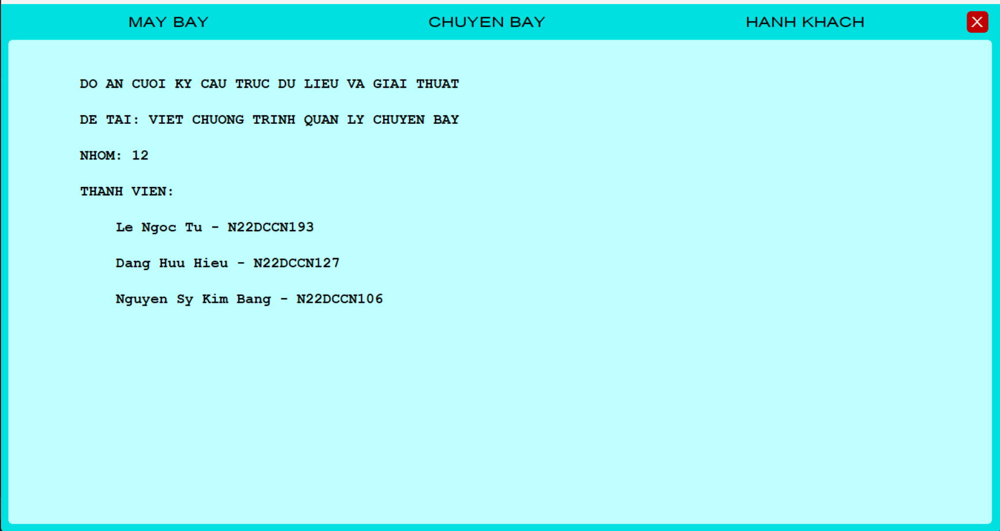

# Đồ Án Cấu Trúc Dữ Liệu Và Giải Thuật - Nhóm 12
## Thành viên:
- Lê Ngọc Tú
- Đặng Hữu Hiếu
- Nguyễn Sỹ Kim Bằng

## Table of Contents
- [Đề tài](#1)
- [Xây dựng chương trình](#2)
- [Đọc kỹ hdsd trước khi dùng](#3)
- [Trải nghiệm thi](#4)

## Đề tài
#### - Quản lý chuyến bay nội địa
#### - Cấu trúc dữ liệu:
- [Máy bay](FlightManagement/Plane.h): Mảng con trỏ tối đa 300 máy bay. Mỗi máy bay có các thông tin(**`Số hiệu MB`**(C15), loại máy bay(C40), số dãy, số dòng); Mỗi máy bay có 1 số hiệu duy nhất; (số chỗ = số dãy * số dòng), số chỗ >= 20.
    Nếu số dãy = 5 nghĩa là máy bay có 5 các dãy A, B, C, D, E; Nếu số dòng = 20 nghĩa là máy bay có các hàng ghế được đánh số từ 1 đến 20.Kết hợp dãy và hàng ghế ta sẽ có số vé
    Theo ví dụ trên, ta có 100 vé với các số vé A01, A02, ....A20, ... E19, E20.
- [Chuyến bay](FlightManagement/Flight.h): danh sách liên kết đơn( **`Mã CB`**(C15), Ngày giờ khời hành, sân bay đến, trạng thái, Số hiệu MB, danh sách vé). Mỗi chuyến bay có 1 mã duy nhất; trạng thái chuyến bay bao gồm: `0: Hủy chuyến` `1: Còn vé` `2: Hết vé` `3: Hoàn tất`; danh sách vé cho biết thông tin vé trên chuyến bay, và số CMND của hành khách đã đặt vé đó. Danh sách vé được cấp phát bộ nhớ tự động dựa vào số chỗ của máy bay thực hiện chuyến bay. **Danh sách chuyến bay luôn có sẵn thứ tự theo mã chuyến bay.**
- [Hành khách](FlightManagement/passenger_tree.h): cây nhị phân tìm kiếm cân bằng(**`Số CMND`**, Ho , Ten, Phai)

#### - Các chức năng theo yêu cầu đề bài:
a) Cập nhật danh sách các máy bay(thêm/ xóa/ hiệu chỉnh)

b) Cập nhật chuyến bay: cho phép lập chuyến bay mới, hiệu chỉnh ngày, giờ khởi hành của chuyến bay, sân bay đến, số hiệu máy bay, hủy chuyến.

c) Đặt vé: cho phép đặt vé trên 1 chuyến bay; nếu thông tin hành khách chưa có thì tự động cập nhật và danh sách hành khách, nếu có rồi thì in ra màn hình để kiểm tra. Mỗi vé đều phải ghi nhận số CMND của hành khách; nếu hành khách chưa có số CMND thì yêu cầu nhập thông tin hành khách trước. Trên một chuyến bay, mỗi hành khách chỉ mua 1 vé.

d) Hủy vé: cho phép hủy vé đã đặt của hành khách.

e) In danh sách hành khách thuộc một chuyến bay dựa vào mã chuyến bay. Kết xuất:

      DANH SÁCH HÀNH KHÁCH THUỘC CHUYẾN BAY #######
      Ngày giờ khởi hành: dd/mm/yyy hh:mm.  Nơi đến: xxxxxxxx

      STT         SỐ VÉ       SỐ CMND     HỌ TÊN      PHÁI

f) In danh sách các chuyến bay khỏi hành trong ngày dd/mm/yyyy đến nơi XXXX (cho biết cụ thể số các vé còn trống và giờ khởi hành)

g) In danh sách các vé còn trống của 1 chuyến bay có mã chuyến bay là X

h) Thống kê số lượt thực hiện chuyến bay của từng máy bay theo thứ tự số lượt thực hiện giảm dần. Kết xuất:

    Số hiệu máy bay             Số lượt thực hiện chuyến bay

> [!NOTE]
> Lưu ý: Chương trình cho phép lưu các danh sách vào file; Kiểm tra điều kiện khi nhập dữ liệu làm dữ liệu bị sai

## Xây dựng chương trình 
#### - Phân công thành viên:    
- Chương trình có 3 cấu trúc dữ liệu chính => mỗi thành viên code 1 CTDL
- Chương trình xử lý 3 vấn đề(tương tác thêm/chỉnh,... 3 cấu trúc dữ liệu chính), chia chương trình thành 3 phần tương ứng, mỗi thành viên một phần(tương ứng với cấu trúc dữ liệu của người đó code)
- Giao diện:
  - Chia 3 tab xử lý chỉnh và 1 giao diện chờ mainmenu:
    - Tab Máy bay
    - Tab Chuyến bay
    - Tab Hành khách
    - Main menu: chờ tín hiệu click chuột để chuyến đến các tab xử lý + hiển thị giới thiệu đề tài, thành viên nhóm
#### - Các vấn đề xử lý 
- **`Máy bay`**: 
- **`Chuyến bay`**:
  - Chức năng lọc và sắp xếp:
    - Lọc theo : Mã MB, Mã CB, thời gian khời hành, nơi đến, trạng thái. Các nội dung nào được chọn thì lọc, không thì bỏ qua
    - Sắp xếp(dùng QuickSort): sắp xếp tăng/ giảm dần theo mã chuyến bay, mã máy bay, thời gian khởi hành, nơi đến
    - Lọc & sort mặc định: lọc các chuyến bay còn vé, sắp tăng dần theo thời gian khởi hành
> [!TIP]
> 1.Các dữ liệu in ra màn hình thông qua một mảng cấp phát động chứa địa chỉ chuyến bay trong danh sách gốc

  - Tự quy ước: Thời gian tối thiểu để một máy bay thực hiện hai chuyến bay liên tiếp là 3h = 3 * 60 phút = 180 phút
  - Điều kiện thêm chuyến bay:
    - Mã chuyến bay không được trùng
    - Mã máy bay phải tồn tại
    - Thời gian khởi hành:
      - Phải là thời gian đúng( ví dụ ngày 31 tháng 2 là thời gian sai)
      - Không được là thời gian trong quá khứ
      - Phải cách hiện tại ít nhất 3h
      - Không được xảy ra xung đột thời gian bay( ví dụ: máy bay đã có một chuyến có thời gian khởi hành hơn kém dưới 3h so với thời gian của chuyến bay mới)
  
  - Điều kiện chỉnh chuyến bay:
    - Chuyến bay có trạng thái `1: Còn vé` hoặc `2: Hết vé`
    - Mã số chuyến bay: Không được chỉnh
    - Mã số máy bay: chỉ được đổi máy bay có cả số dãy và số dòng đều lớn hơn hoặc bằng số dãy và số dòng của máy bay cũ
    - Thời gian: 
      - Là thời gian đúng(vd: 31thg2 là thời gian sai)
      - Không được điều chỉnh bay sớm hơn thời gian cũ
      - Không được xung đột thời gian bay:
        - Máy bay đã có chuyến bay khác có thời gian bay chênh lệch dưới 3h
        - Có hành khách trong chuyến bay đã đồng thời đặt vé trong chuyến bay khác có thời gian bay chênh lệch dưới 3h

  - Điều kiện đặt/ hủy vé: trạng thái chuyến bay là `1: Còn vé` hoặc `2: Hết vé`
  - Điều kiện hủy chuyến bay: trạng thái chuyến bay là `1: Còn vé` hoặc `2: Hết vé`
  - Điều kiện in danh sách hành khách trong chuyến bay: luôn in được
- **`Hành khách`**:

## Hướng dẫn chạy CT + ảnh demo 

#### - Hướng dẫn tải và chạy CT
- Chương trình sử dụng đồ họa Graphics.h
- Biên dịch bằng DevC(chỉ dùng được complier 32 bit)
- Tải DevC và cài đặt thư viện Graphics.h [tại đây](https://www.google.com) :smiley:
- Clone repo về máy
- Dùng DevC mở và chạy [CreateData.dev](CreateData/CreateData.dev) để tạo folder `Data`
- Copy folder `Data` vào folder `FlightManagement`
- Dùng DevC mở và chạy [FlightManagement.dev](FlightManagement/FlightManagement.dev)

> [!NOTE]
> Tìm hiểu thêm về các hàm trong thư viện Graphics.h: <https://home.cs.colorado.edu/~main/bgi/doc/>

#### - Ảnh demo
##### Main menu

##### Plane tab

##### Flight tab

##### Passenger tab

## Trải nghiệm thi
Nhóm mình thi chiều ngày 27/6/2024
Quá trình thầy chấm bài:
- Xem các cấu trúc dữ liệu đã cài đặt đúng chưa
- Xem các chức năng(giao diện sử dụng + code + yêu cầu giải thích ý tưởng thuật toán, ...)
- Câu hỏi lý thuyết nằm trong các kiến thức về `Cấu trúc dữ liệu` đã học
- Cuối cùng là một câu hỏi tương đối khó, thầy cho một khoảng thời gian suy nghĩ (~5phút), mỗi thành viên trong nhóm tự suy nghĩ trả lời, không làm chung. Câu hỏi dạng này là mỗi nhóm mỗi khác, chỉ khi nhóm trước không trả lời được thì có khả năng nhóm sau sẽ được đặt câu hỏi tương tự.

Kết quả thi:
- [ ] Qua môn :satisfied:
- [ ] A+
- [ ] A
- [ ] B+
- [ ] B
- [ ] C+
- [ ] C
- [ ] Rớt môn :scream: